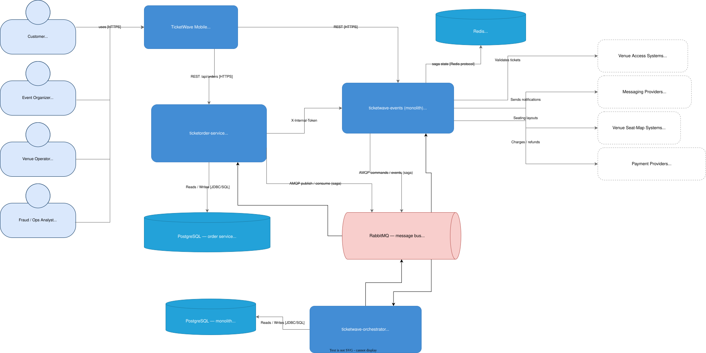

# TicketWave Events

Modular monolithic platform (Spring Boot 4, Java 21) for event management and ticket sales. The domain is organized around domain events and commands published over a **hexagonal bus** that is transported in memory (development/test) or via **RabbitMQ** (`rabbitmq` profile), allowing an external saga orchestrator to drive the complete purchase flow.

## Architecture Diagrams

Documentation diagrams (SVG, editable in draw.io):

### C4 model — `diagrams/c4model/`



| Level | File | Description |
|-------|------|-------------|
| C1 | `ticketwave-c1-context.drawio.svg` | System context: users and external systems around TicketWave |
| C2 | `ticketwave-c2-container.drawio.svg` | Containers: web/API, monolith, database, Redis |
| C3 | `ticketwave-c3-event-search.drawio.svg` | Component: event search |
| C3 | `ticketwave-c3-digital-ticket-service.drawio.svg` | Component: digital ticket service |
| C3 | `ticketwave-c3-ticket-purchase.drawio.svg` | Component: ticket purchase flow |
| C3 | `ticketwave-c3-payment-service.drawio.svg` | Component: payment service |
| C3 | `ticketwave-c3-promotions-service.drawio.svg` | Component: promotions service |
| C3 | `ticketwave-c3-notifications-service.drawio.svg` | Component: notifications service |
| C3 | `ticketwave-c3-refunds-cancellations.drawio.svg` | Component: refunds & cancellations |


## Technologies

- **Java 21**, **Spring Boot 4**
- **Spring Data JPA** + PostgreSQL (H2 for the `local`/`test` profiles)
- **Spring Security + JWT** (jjwt 0.12)
- **Spring AMQP / RabbitMQ** (domain events and commands)
- **Redis** (ticket locking and fraud detection; optional in the `local` profile)
- **OpenAPI / Swagger UI** (springdoc)
- **Lombok**

## Requirements

- JDK 21
- Maven 3.9+
- PostgreSQL 15+ (or use the `local` profile with embedded H2)
- RabbitMQ 4.x (only for the `rabbitmq` profile; `docker-compose.yml` in the `ticketwave-event-bus` module)
- Redis 7+ (optional in the `local` profile)

## Docker (external dependencies)

Independent containers (you can start them separately or together):

```bash
# rabbitmq
docker run -d --name rabbitmq -p 5672:5672 -p 15672:15672 rabbitmq:4-management

# redis
docker run -d --name redis -p 6379:6379 redis:7-alpine
```

RabbitMQ management panel: [http://localhost:15672/#/queues](http://localhost:15672/#/queues) (user/password: `guest`/`guest`). There you can inspect the exchanges (`ticketwave.events`, `ticketwave.commands`), the queues (`ticketwave.events.all`, `ticketwave.commands.all`) and the published messages.

## Architecture: domain buses

The business communicates through **events** (`DomainEvent`) and **commands** (`Command`) via two hexagonal ports:

| Port      | Interface                | In-memory (`!rabbitmq`)      | RabbitMQ (`rabbitmq`)        |
|-----------|--------------------------|------------------------------|------------------------------|
| Events    | `EventBus`               | `InMemoryEventBus`           | `RabbitMQEventBusAdapter`    |
| Commands  | `CommandBus`             | `InMemoryCommandBus`         | `RabbitMQCommandBusAdapter`  |

- The RabbitMQ event exchange is `ticketwave.events` (queue `ticketwave.events.all`).
- The command exchange is `ticketwave.commands` (queue `ticketwave.commands.all`).
- The topology is declared automatically at startup (`RabbitMQEventBusAdapter.declareTopology`).
- Each event/command is published with **routing key = simple class name** and `#` at the queue, so any monolith instance (or an external orchestrator) can consume them.
- AMQP serialization is JSON with polymorphic typing (`Jackson2JsonMessageConverter`), allowing the concrete records to be deserialized.

Domain events (`com.ticketwave.domain.events`): `TicketOrderCreated`, `TicketOrderConfirmed`, `TicketOrderCancelled`, `TicketOrderCompleted`, `PaymentAuthorized`, `PaymentFailed`, `TicketIssued`, `TicketDeliveryFailed`, `NotificationSent`, `NotificationFailed`, `TicketRefunded`, `EventCreated`, `EventUpdated`, `EventCancelled`, `FraudDetected`, `PromotionApplied`.

Commands (`com.ticketwave.domain.commands`): `ProcessPaymentCommand`, `IssueTicketCommand`, `NotifyOrderCommand`, `CancelTicketOrderCommand`, `RefundPaymentCommand`.

Subscribers register against the ports: `NotificationEventSubscriber`, `VenueEventSubscriber`, `PaymentEventSubscriber`, `ConfirmOrderUseCase` (payment), `IssueTicketUseCase` (issuance), `PaymentService` (refund).

## Structure

```
ticketwave-events/
 ├── src/main/java/com/ticketwave/
 │   ├── TicketwaveApplication.java
 │   ├── application/      # Use cases and application services
 │   ├── config/           # EventBusConfig, Security, JWT, OpenAPI, Cache, DataSeeder
 │   ├── domain/           # Entities, domain events and commands
 │   │   ├── bus/          # EventBus / CommandBus ports
 │   │   ├── commands/     # Saga commands
 │   │   └── events/       # Domain events
 │   ├── infrastructure/
 │   │   ├── bus/          # In-memory and RabbitMQ adapters
 │   │   ├── controller/   # RestControllers
 │   │   ├── dto/          # Request/Response records
 │   │   ├── notification/ # Subscriber + notification service
 │   │   ├── order/        # ticketorder-service client
 │   │   ├── payment/      # Subscriber + payment repository
 │   │   ├── repository/   # Data access
 │   │   ├── redis/        # Redis cache / ticket locking
 │   │   ├── security/     # JWT and internal filters
 │   │   ├── util/         # QrCodeGenerator, PriceCalculator
 │   │   └── venue/        # Venue system subscriber
 │   └── modules/          # Modular boundaries
 ├── src/main/resources/   # application.yml, application-local.yml, application-rabbitmq.yml
 └── src/test/             # Integration tests (in-memory and RabbitMQ)
```

## Running

```bash
# Local development (in-memory H2, in-memory buses, no Redis)
mvn spring-boot:run -Dspring-boot.run.profiles=local

# RabbitMQ (buses over RabbitMQ; requires RabbitMQ on localhost:5672)
docker compose up -d
mvn spring-boot:run -Dspring-boot.run.profiles=rabbitmq

# Production (PostgreSQL + Redis + RabbitMQ, environment-variable configuration)
DB_URL=jdbc:postgresql://localhost:5432/ticketwave \
DB_USERNAME=postgres DB_PASSWORD=postgres \
REDIS_HOST=localhost REDIS_PORT=6379 \
JWT_SECRET=<32-byte-secret> \
RABBITMQ_HOST=localhost RABBITMQ_PORT=5672 \
mvn spring-boot:run -Dspring-boot.run.profiles=rabbitmq
```

Swagger UI: http://localhost:8079/swagger-ui.html

### Swagger to publish messages on the bus (rabbitmq)

To publish a `TicketOrderCreated` event on the bus (under the `rabbitmq` profile it is routed to the `ticketwave.events` exchange), open Swagger and use the **Event Publishing** endpoint:

[Publish TicketOrderCreated in Swagger](http://localhost:8079/swagger-ui/index.html#/Event%20Publishing/publishTicketOrderCreated)

or open the URL directly:

1. Expand `POST /api/events/publish/ticket-order-created`.
2. In **Try it out** fill in the body, for example:

   ```json
   {
     "orderId": "3faf6f78-8a3c-4a1e-b7a9-000000000001",
     "userId": "a1b2c3d4-0000-0000-0000-000000000001",
     "eventId": "c71f9a1e-0000-0000-0000-000000000002",
     "quantity": 2,
     "total": 200.00,
     "discount": 0
   }
   ```

3. Execute it and expect a `202 Accepted` with the event `id`.

> The port depends on the active profile (`server.port`: `8079` by default in `application.yml`). Adjust `localhost:8079` if your local configuration uses another port.

## Demo credentials (automatic seed)

| Username | Password | Role  |
|----------|----------|-------|
| admin    | admin1234| ADMIN |
| user     | user1234 | USER  |

## Main endpoints

| Method | Route                                        | Description                                   |
|--------|----------------------------------------------|-----------------------------------------------|
| GET    | `/api/events`                                | Paginated search (city, venue, dates)         |
| POST   | `/api/events`                                | Create event (ADMIN)                          |
| PUT    | `/api/events/{id}`                           | Update event (ADMIN)                          |
| DELETE | `/api/events/{id}`                           | Cancel event (ADMIN)                          |
| POST   | `/api/events/{id}/reserve`                   | Reserve capacity (ADMIN)                      |
| POST   | `/api/events/{id}/release`                   | Release capacity (ADMIN)                      |
| POST   | `/api/events/publish/ticket-order-created`   | Publish `TicketOrderCreated` on the bus (test) |
| POST   | `/api/payments`                              | Confirm reservation with payment (Stripe/PayPal) |
| GET    | `/api/payments/order/{orderId}`              | Get payment by order                          |
| POST   | `/api/tickets/validate`                      | Validate ticket at venue (ADMIN)              |
| POST   | `/api/tickets/{id}/refund`                   | Refund ticket                                 |
| GET    | `/api/tickets/order/{orderId}`               | Tickets of an order                            |
| POST   | `/api/promotions`                            | Create promotion                               |
| POST   | `/api/promotions/{code}/quote`               | Quote with discount                           |
| POST   | `/api/users/register`                        | Register                                       |
| POST   | `/api/users/login`                           | Login → JWT                                    |
| GET    | `/api/users/me`                              | Current profile                                |
| GET    | `/api/notifications`                         | User notifications                             |
| GET    | `/api/fraud/check`                           | Fraud risk assessment                          |
| POST   | `/api/fraud/guard`                           | Fraud guard                                    |
| POST   | `/api/fraud/orders`                          | Report fraudulent order                        |

## Purchase flow (saga over the bus)

1. The orchestrator (`ticketwave-orchestrator` service) publishes `TicketOrderCreated` on `ticketwave.events`.
2. `ConfirmOrderUseCase` consumes `ProcessPaymentCommand` (queue `ticketwave.commands.all`), charges and publishes `PaymentAuthorized`/`PaymentFailed`.
3. `IssueTicketUseCase` consumes `IssueTicketCommand` and issues the digital tickets with QR code.
4. `NotificationEventSubscriber` consumes `NotifyOrderCommand` and sends the purchase-completed notification.
5. Events such as `TicketOrderCancelled`, `TicketRefunded`, etc. compensate the order and reflect the state in the venue and payments.

Under the `local`/`test` profiles this same flow runs with the in-memory buses, so the logic can be tested without external infrastructure.

## Testing

```bash
mvn test
```

| Test                            | Active profiles | What it verifies                                                                 |
|---------------------------------|-----------------|----------------------------------------------------------------------------------|
| `TicketOrderFlowIntegrationTest`| `test`          | Full saga with in-memory buses + H2 (commands, tickets, payment, notifications) and idempotency when commands are duplicated |
| `RabbitMQEventBusRoundTripTest` | `test` + `rabbitmq` | The `EventBus` bean is `RabbitMQEventBusAdapter` and `publish` routes to the `ticketwave.events` exchange |

> The RabbitMQ test requires an instance on `localhost:5672` (docker-compose from the `ticketwave-event-bus` module). It does not depend on the shared `ticketwave.events.all` queue so it does not compete with other running instances.

## Security

- JWT bearer token issued at `/api/users/login` and `/api/users/register`.
- Administrative endpoints protected with `@PreAuthorize("hasRole('ADMIN')")`.
- Internal endpoints (`/api/events/*/reserve`, `/api/promotions/*/quote`, `/api/fraud/guard`, `/api/users/by-username/**`) protected by an internal token (`internal-token`).
- Fraud detection: attempt limits per user/IP in Redis, prevention of duplicate orders.